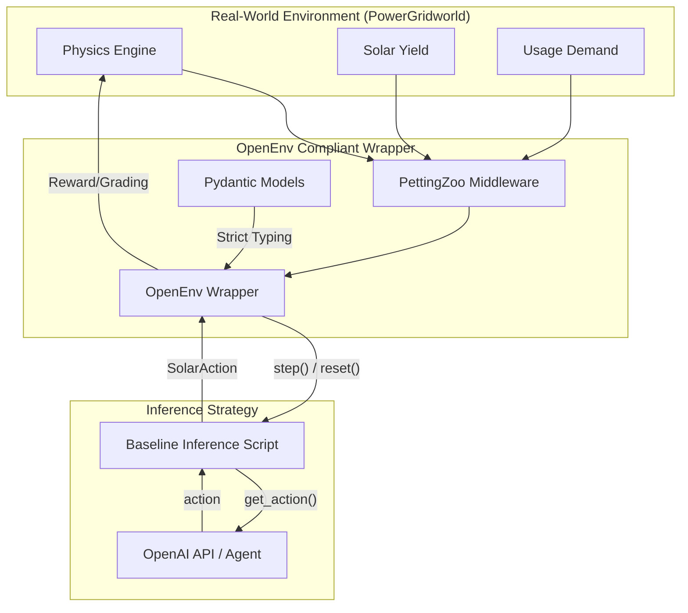

# Architecture: OpenEnv Autonomous Energy Dispatcher

This project implements a **Real-World Task Simulation** for autonomous energy management across a solar-powered grid, fully compliant with the **OpenEnv** specification.

## 🏛️ System Design

The system is built to transform **PowerGridworld** (the physics engine) into a high-level **OpenEnv** task for AI agents to solve.

### 1. The Core Infrastructure
- **Base Engine**: [PowerGridworld](https://github.com/NREL/PowerGridworld) handles the power flow physics.
- **MARL Middleware**: [PettingZoo](https://pettingzoo.farama.org/) facilitates interactions between multiple smart homes/nodes.
- **Task Standardization**: **OpenEnv Wrapper** implements the Pydantic-based `Observation`, `Action`, and `Reward` models.

### 2. OpenEnv Spec Compliance
The environment strictly follows the `openenv.yaml` schema and provides the following interface:
- **`reset()`**: Initializes the grid state and returns the current `SolarObservation`.
- **`step(action: SolarAction)`**: Applies energy routing decisions and returns `(SolarObservation, SolarReward, done, info)`.
- **`state()`**: Provides a global snapshot of the entire power grid (not just local observations).

### 3. Real-World Task Scenarios
The environment supports three distinct, pre-configured tasks for performance evaluation:

| Task ID | Name | Objective | Difficulty | Grader Criteria |
| --- | --- | --- | --- | --- |
| `maximize-self-consumption` | **Efficiency Hero** | Minimize grid draw during surplus solar production. | Easy | `(SolarProduced - GridExport) / TotalUsage` |
| `peak-shaving` | **Peak Saver** | Maintain grid draw below 2kW during peak pricing (5-9 PM). | Medium | `max(0, 1 - (PeakDraw / Limit))` |
| `emergency-load-shedding` | **Grid Stabilizer** | Prevent localized blackouts by shedding non-critical loads during high grid stress. | Hard | `TimeInSafeVoltageRange / TotalTime` |

### 4. Meaningful Reward Function
The reward signal is not binary. It provides a dense signal at every step:
- **Positive**: Each watt of solar energy used locally instead of imported from the grid.
- **Negative**: High peak consumption during high-cost intervals.
- **Heavy Penalty**: Destructive behaviors (e.g., draining battery to 0% during peak cost or causing voltage spikes).

## 🔄 Execution Flow

## 🛠️ Validation Metrics
1. **`openenv validate`**: Ensuring full YAML and Pydantic compliance.
2. **`baseline_inference.py`**: A reproducible script that uses GPT-4o (via OpenAI API) to solve the 3 tasks and produces a score between 0.0 and 1.0 for each.
